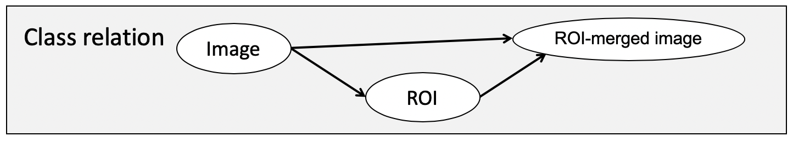
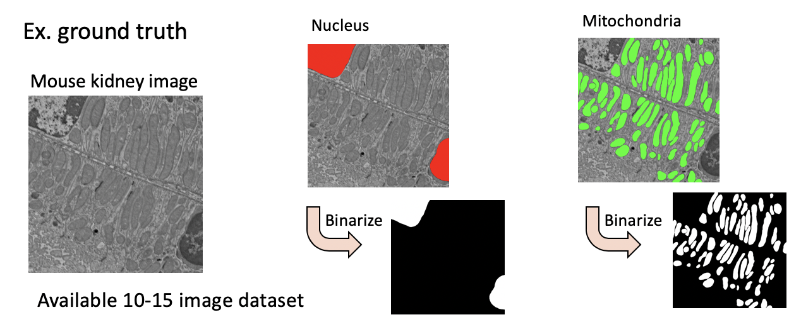

<h1 align="center">
    BH2019-Fukuoka 
</h1>

## Metadata annotation for image data using machine learning 
Member : 

Description :  
- To discuss the metadata description (phenotypes/morphology) for ROI &/or masked region.
- To try the development of the supporting system of metadata annotation for the insight view of images using the machine learning.
-  To consider an effective  amplification of training data from a few dataset.

## Computation environment
Machine
- PC : HPCT W111ga
- CPU : Intel Skylake CPU W-2123 (3.60 GHz, 4Core)
- GPU : NVIDIA TITAN RTX (GDDR6 24GB) x 2
- Memory : 128 GB 

OS / Software
- OS : CentOS Linux 7.6.1810
- NVIDIA Driver : 418.67 / gcc : 4.8.5
- CUDA : V9.0.176
- Rstudio (R version 3.6.0), R-Keras 2.2.4, R-TensorFlow 1.11.0 (Backend)

## Metadata Concept

## Process for image segmentaiton
1. Image dataset
    1. Mouse B6J kidney electron microscopy images
    	1. [Nucleus](https://github.com/kumeS/BH2019-Fukuoka/tree/master/01_ImageDataset/01_Mouse_B6J_Kidney_Nucleus_All_ver190903)
    	2. Mitochondria
    	   
    2. Croped images around 1000 x 1000 px
2. Pre-processing
    1. resize for images, 128 px, 256 px, 512 px squares (We do not know which the better)
    2. normalize
    3. clahe (Contrast Limited Adaptive Histogram Equalization)
    4. Gamma Correct (this is not so important)
    5. Image amplification
    	1. rotate 0, 90, 180, 270
    	2. Horizontal translation, 1/8-7/8 tick
    	3. Vertical translation, 1/8-7/8 tick

find ~/Desktop/sk_GitHub/BH2019-Fukuoka -name ".DS_Store" -print&nbsp; -exec rm {} ";"