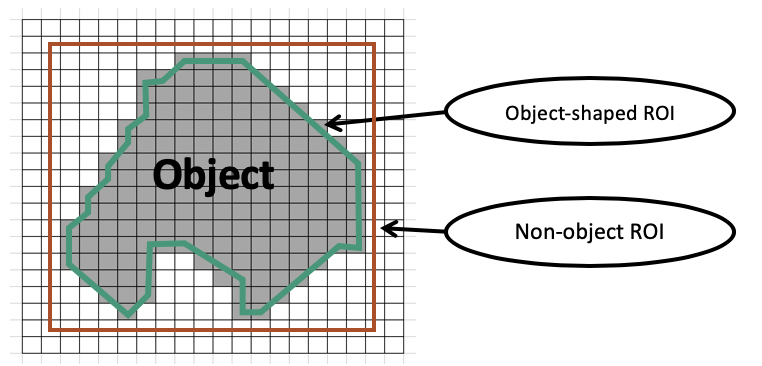

<h1 align="center">
  <br/> BH2019-Fukuoka 
</h1>

## Metadata annotation for image data using machine learning 
Member : Satoshi Kume, Norio Kobayashi, Hiroshi Masuya

Description : <br/>
- To discuss the metadata description (phenotypes/morphology) for ROI &/or masked region.
- To try the development of the supporting system of metadata annotation for the insight view of images using the machine learning.
-  To consider an effective  amplification of training data from a few dataset.

## Metadata Concept
<br/>
<br/>

## Use case


## Computation environment
Machine
- PC : HPCT W111ga
- CPU : Intel Skylake CPU W-2123 (3.60 GHz, 4Core)
- GPU : NVIDIA TITAN RTX (GDDR6 24GB) x 2
- Memory : 128 GB 

OS / Software
- OS : CentOS Linux 7.6.1810
- NVIDIA Driver : 418.67 / gcc : 4.8.5
- CUDA : V9.0.176
- Rstudio (R version 3.6.0), R-Keras 2.2.4, R-TensorFlow 1.11.0 (Backend)

## Process for image segmentaiton
1. Image dataset
    1. Mouse B6J kidney electron microscopy images
    	1. [Nucleus](https://github.com/kumeS/BH2019-Fukuoka/tree/master/01_ImageDataset/01_Mouse_B6J_Kidney_Nucleus_All_ver190903)
    	2. Mitochondria
    2. Croped images around 1000 x 1000 px<br/>
 <br/>
2. Pre-processing
    1. Resize for images: 512 - 1024 px square
    2. Normalization
    3. Clahe (Contrast Limited Adaptive Histogram Equalization)
    4. Gamma Correct (this is not so important)
    5. Training image amplification : This step was skipped in BH19 due to time consuming.
    	1. Rotation : 0, 90, 180, 270 degree
    	2. Flip : Y/N
    	3. Horizontal translation : 1/8-7/8 tick
    	4. Vertical translation : 1/8-7/8 tick
    6. RandomSequence of images
		```R 
		library(random)
		Ran <- c(random::randomSequence(min=1, max=length(XYG$X), col=1))
		```
    7. list2tensor
		```R 
		list2tensor <- function(xList) {
		xTensor <- simplify2array(xList)
		aperm(xTensor, c(4, 1, 2, 3)) }
		```  
3. Deep learning model 
	1. Model
		1. U-NET : [Olaf Ronneberger et al, U-Net: Convolutional Networks for Biomedical Image Segmentation](https://arxiv.org/abs/1505.04597)
		2. [The modified model in this project](https://github.com/kumeS/BH2019-Fukuoka/blob/master/03_DL_model/UNET_modified_model.pdf)
	2.  Evaluation metrics
		1. IoU (Intersection-Over-Union)
		```R
		iou <- function(y_true, y_pred, smooth = 1.0){
		y_true_f <- k_flatten(y_true)
		y_pred_f <- k_flatten(y_pred)
		intersection <- k_sum( y_true_f * y_pred_f)
		union <- k_sum( y_true_f + y_pred_f ) - intersection
		result <- (intersection + smooth) / ( union + smooth)
		return(result)}
		```
		2. Dice Coefficient (F1 score)<br/>
		```R
		dice_coef <- function(y_true, y_pred, smooth = 1.0) {
		y_true_f <- k_flatten(y_true)
		y_pred_f <- k_flatten(y_pred)
		intersection <- k_sum(y_true_f * y_pred_f)
		result <- (2 * intersection + smooth) / 
		(k_sum(y_true_f) + k_sum(y_pred_f) + smooth)
		return(result)}
		```
		[metrics in detail](https://towardsdatascience.com/metrics-to-evaluate-your-semantic-segmentation-model-6bcb99639aa2)

	3. Prameter tuning
		```R
		FLAGS <- flags(
		flag_numeric("kernel_size", 3),
		flag_numeric("nlevels", 3),
		flag_numeric("nfilters", 128),
		flag_numeric("BatchSize", 4),
		flag_numeric("dropout1", 0.1),
		flag_numeric("dropout2", 0.1),
		flag_numeric("dropout3", 0.1))
		```
		1. Prameter tuning - Learning rate
			1. 1st
		```R
		lr_schedule <- function(epoch, lr) {
		if(epoch <= 10) {
 			0.01
		} else if(epoch > 10 && epoch <= 50){
 			0.001
		} else if(epoch > 50 && epoch <= 75){
 			0.0001
		} else if(epoch > 75 && epoch <= 100){
  			0.00001
		} else if(epoch > 100 && epoch <= 200){
 			0.000001
		} else {
			0.000001 }}
		lr_reducer <- callback_learning_rate_scheduler(lr_schedule)
		```
			2. 2nd
		```R
		lr_schedule <- function(epoch, lr) {
		if(epoch <= 25) {
		0.001
		} else if(epoch > 25 && epoch <= 50){
		0.0001
		} else if(epoch > 50 && epoch <= 75){
		0.00001
		} else {
		0.00001 }}
		```
			3. 3rd
			4. 4th
4. Image Dataset
		1. Training images : 44 images
		2. Cheching images during training : 5 images
5. Calculation
	1. Result 1 : Failed
	2. Result 2 
		1. run 01 <br/>
		 <br/>
		2. run 02 <br/>
		 <br/>
		3. run 03 <br/>
		 <br/>	
		4. run 04 <br/>
		 <br/>	
	3. Evaluation of training result 2
		1. Good result<br/>
		 <br/>
		2. Bad result<br/>
		 <br/>
	4.  Evaluation of test result
		1. Good result<br/>
		 <br/>		
		 <br/>				
		 <br/>		
		 <br/>		
				
6. Evaluation and modification cycle of results
	1. ideas from
		1. [Morphological Snakes GitHub : Morphological snakes for image segmentation and tracking](https://github.com/pmneila/morphsnakes)
		2. [Microscopy Image Browser: A Platform for Segmentation and Analysis of Multidimensional Datasets](https://journals.plos.org/plosbiology/article/file?id=10.1371/journal.pbio.1002340&type=printable)
		3. [Microscopy Image Browser Watershed/Graphcut segmentation](http://mib.helsinki.fi/help/main2/ug_gui_menu_tools_watershed.html)
7. Particle shape
	1. ideas from 
		1. [BioVoxxel/ImageJ](https://imagej.net/BioVoxxel_Toolbox) <br/>
		<br/>
		2. [Rounding & sphericity ES.svg](https://commons.wikimedia.org/wiki/File:Rounding_%26_sphericity_ES.svg)<br/>
		<br/>
		3. [2D particle shape analysis](https://forum.image.sc/t/2d-particle-shape-analysis/6920)<br/>
		<br/>
	
		
